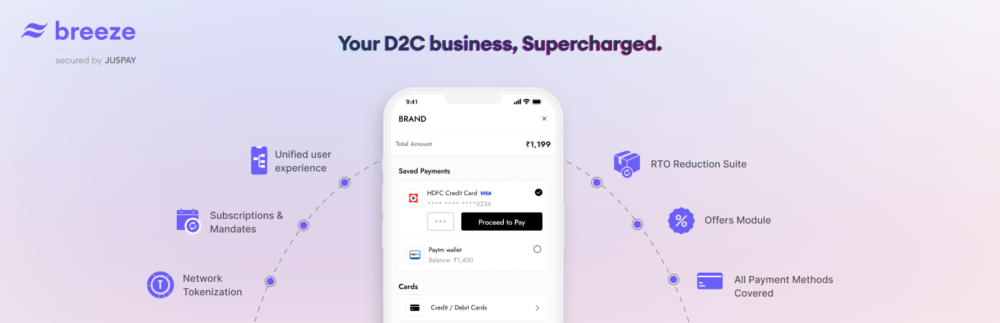

  

<h1 align="center">Breeze Checkout for WooCommerce</h1>

  

 

## Description

**Breeze 1-Click Checkout** is a streamlined checkout solution built from the ground up, specifically for D2C brands. It offers an unparalleled checkout experience, ensuring some of the highest conversion rates in the industry. With Breeze, new customers will enjoy the convenience of auto-populated shipping addresses directly from their Breeze Shopping Profile.

Created by Juspay, which powers the payment experience for top consumer apps in India, Breeze integrates seamlessly with over 100 payment gateways/aggregators, giving your customers a wide range of payment options. Our advanced orchestration layer intelligently routes payments through the most reliable provider using health signals from a large network of merchants, ensuring maximum uptime and success rates.

 

### Key Features

- **True 1-Click Checkout Experience**: Reduce friction by auto-populating customer shipping details, enabling fast and easy checkout.
- **Extensive Payment Methods**: Supports UPI, Credit Cards, BNPL, Wallets, Gift Cards, Net Banking, and more.

- **No-Code Integration with 100+ Payment Gateways**: Seamlessly connect with over 100 gateways without writing any code.

- **Advanced Payment Orchestration**: Automatically routes payments through the most reliable providers based on real-time health signals.

- **Customizable Checkout Experience**: Personalize the checkout flow with brand-specific customization options.

- **Powerful Rewards Engine**: Boost your sales with a rewards engine that helps increase order value and volume.

- **Enterprise-Grade Analytics & Administration**: Access detailed analytics and manage transactions from an advanced dashboard.

 

### Additional Features

- **Refunds**: Manage refunds effortlessly. Once a refund is initiated in WooCommerce, it is automatically processed in the Juspay Dashboard, making the entire flow seamless and efficient.

- **Offers**: Breeze fully supports all offers created through WooCommerce's default offer settings, with no need for additional plugins.

- **Partial COD (Cash on Delivery) Support**: Reduce RTO (Return to Origin) rates by offering Partial COD options, providing customers with more payment flexibility while protecting your business from risks.

- **Unified Dashboard**: Manage all aspects of your transactions, refunds, subscriptions, and more from a single, unified dashboard. Gain insights into customer journeys and make informed business decisions with ease.

- **Fraud and Risk Management**: Integrated with leading fraud prevention platforms to validate customer details and ensure secure transactions, helping to reduce fraud and safeguard your business.

 

## Sign Up

To get started with Breeze Checkout, [sign up here](https://breeze.in).

 

## Installation Instructions

### Manual Installation:

1. Upload the plugin files to the `/wp-content/plugins/breeze-button` directory via an FTP client or hosting control panel.

### Installation via WordPress Dashboard:

1. Go to the WordPress admin area, navigate to "Plugins," and click "Add New."
2. Upload the plugin zip file or search for "Breeze Checkout" if it is available in the WordPress Plugin Repository.
3. Click "Install Now," and once installation is complete, click "Activate."

Once activated, Breeze Checkout will be ready to configure and use.

 

## Frequently Asked Questions (FAQ)

**1. Does Breeze Checkout support all payment gateways?**

Yes, Breeze connects with over 100 payment gateways and aggregators, offering a wide range of payment methods, including UPI, credit/debit cards, wallets, and more.

**2. Can I customize the checkout flow?**

Absolutely! Breeze allows you to tailor the checkout experience to match your brand’s look and feel, providing a cohesive and seamless experience for your customers.

**3. How does Breeze help reduce fraud?**

Breeze integrates with top third-party fraud management systems to validate customer addresses and prevent fraudulent transactions, ensuring the highest levels of security.

 

## Changelog

**Version 1.0.0**

- Initial release of Breeze Checkout for WooCommerce.
- Includes 1-click checkout, payment gateway integration, refund management, offer support, and more.

 

## License

This product is licensed under the [Apache 2.0 License](./LICENSE).
